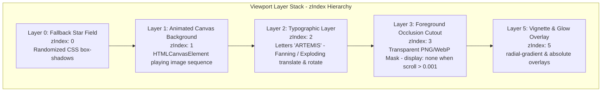

# 🌌 Master Blueprint: Interactive Scrollable Zip-File Hero
### *High-Performance Scroll-Canvas Sequence & Depth-Aware Occlusion Layering*

This blueprint combines all architectural patterns, mathematical formulas, asset optimization pipelines, and production-ready code blocks to replicate the premium **Scroll-Triggered Canvas Hero with Text Occlusion** in any new React/Next.js or Vite/Vanilla JS project.

---

## 📐 Conceptual & Visual Architecture

The **Interactive Scrollable Zip-File Hero** is a premium, cinematic landing experience that leverages a series of high-performance techniques to make background text appear physically sandwiched behind a 3D-scrolling foreground element (e.g., a robot or scooter), fanning away and fading out as the user scrolls.



### 🗝️ Core Technical Breakthroughs

1. **The Occlusion Display Hiding Trick (Critical):** By placing a transparent cutout mask of the foreground object (`robot_masked.webp`) at `zIndex: 3`, the header text at `zIndex: 2` appears strictly behind the object. However, as the user scrolls, the canvas begins animating to other frames where the object moves. A static cutout would create a jarring double-image artifact. To solve this, **the cutout's display property is instantly set to `none` as soon as scroll progress exceeds `0.001`**. Because the text is also programmed to fan out and fade away rapidly (fully invisible within the first 20% of scroll), this transition is completely imperceptible to the eye, resulting in a perfect 3D depth illusion.
2. **Dual-Phase Loading Pipeline:** Loading 100+ frames synchronously blocks page renders. We solve this by first preloading **Frame 0** (a high-res starter background image) to instantly display the page (`isLoaded = true`), and then lazy-loading the remaining compressed WebP frames in a deferred background loop. The **final frame** is loaded as a high-fidelity uncompressed PNG to ensure the animation rests on a razor-sharp finish.
3. **Canvas Aspect-Ratio Cover Math:** To behave exactly like `object-fit: cover` on all viewports, the aspect ratios of the images and canvas are dynamically checked and cropped on the fly.
4. **Spring-Physics & Frame-Throttling:** Canvas drawing is throttled inside a `requestAnimationFrame` loop, rendering a frame *only* when the mapped scroll index changes to prevent CPU thrashing.

---

## 🛠️ Phase 1: Asset Preparation & Optimization Pipeline

Before writing code, raw images (usually rendered as hundreds of high-res PNG frames from Blender, CAD, or Adobe After Effects) must be packed, masked, and optimized.

### 📦 1. Packing & Compression Pipeline (`convert-frames.mjs`)
When assets are delivered as a compressed `.zip` archive, we use a Node.js script with the high-performance `sharp` library to batch-compress files. This script programmatically resizes and converts large PNG frames into ultra-lightweight WebP files, fitting a 75–110 frame sequence **under 500KB total** (well within a strict 2MB mobile budget).

```javascript
import sharp from 'sharp';
import { readdirSync, mkdirSync, statSync } from 'fs';
import { join } from 'path';

const INPUT_DIR = './Hero/extracted';
const OUTPUT_DIR = './public/hero';
const TARGET_QUALITY = 65; // Balanced for excellent compression vs. high visual fidelity

mkdirSync(OUTPUT_DIR, { recursive: true });

const files = readdirSync(INPUT_DIR)
  .filter(file => file.endsWith('.png'))
  .sort((a, b) => a.localeCompare(b, undefined, { numeric: true, sensitivity: 'base' }));

console.log(`🚀 Found ${files.length} frames. Compressing to WebP...`);

let totalSize = 0;

for (let i = 0; i < files.length; i++) {
  const file = files[i];
  const inputPath = join(INPUT_DIR, file);
  // Pad filenames to 3 digits (e.g. 001.webp)
  const outputFileName = `${(i + 1).toString().padStart(3, '0')}.webp`;
  const outputPath = join(OUTPUT_DIR, outputFileName);

  await sharp(inputPath)
    .resize(1920, 1080, { fit: 'cover' }) // Enforce HD baseline
    .webp({ quality: TARGET_QUALITY })
    .toFile(outputPath);

  const stats = statSync(outputPath);
  totalSize += stats.size;
}

console.log(`✅ Compression complete!`);
console.log(`📦 Mapped ${files.length} frames to ${OUTPUT_DIR}`);
console.log(`💾 Total Output Size: ${(totalSize / 1024 / 1024).toFixed(2)} MB`);
```

### ✂️ 2. Occlusion Mask Extraction Pipeline (`extract_robot_cv.py`)
To isolate the foreground object for the depth-aware occlusion layer, we run a Python script using OpenCV to compare a frame containing the foreground object against a clean background frame, generating a transparent alpha mask.

```python
import cv2
import numpy as np

# Load the background plate and the plate with the foreground object
img_bg = cv2.imread("public/hero/clean_background.jpg")
img_obj = cv2.imread("public/hero/Robotbackground_new_start.jpeg")

if img_bg is None or img_obj is None:
    print("❌ Error: Could not load frames. Verify paths.")
    exit(1)

# Ensure images match in size
img_bg = cv2.resize(img_bg, (img_obj.shape[1], img_obj.shape[0]))

# Convert to grayscale for absolute difference math
gray_bg = cv2.cvtColor(img_bg, cv2.COLOR_BGR2GRAY)
gray_obj = cv2.cvtColor(img_obj, cv2.COLOR_BGR2GRAY)

# Absolute difference highlights changes
diff = cv2.absdiff(gray_bg, gray_obj)

# Threshold to ignore compression noise and soft shadows (adjust threshold value 40 as needed)
_, thresh = cv2.threshold(diff, 40, 255, cv2.THRESH_BINARY)

# Morphological clean up of loose pixels
kernel = np.ones((5, 5), np.uint8)
thresh = cv2.morphologyEx(thresh, cv2.MORPH_OPEN, kernel)
thresh = cv2.morphologyEx(thresh, cv2.MORPH_CLOSE, kernel)

# Grab the contour of the foreground object
contours, _ = cv2.findContours(thresh, cv2.RETR_EXTERNAL, cv2.CHAIN_APPROX_SIMPLE)

if contours:
    largest_contour = max(contours, key=cv2.contourArea)
    
    # Render filled mask channel
    clean_mask = np.zeros_like(gray_bg)
    cv2.drawContours(clean_mask, [largest_contour], -1, (255), thickness=cv2.FILLED)
    
    # Slightly dilate mask to prevent edge-fringing
    clean_mask = cv2.dilate(clean_mask, kernel, iterations=1)
    
    # Add alpha channel to image and bind the generated mask
    img_bgra = cv2.cvtColor(img_obj, cv2.COLOR_BGR2BGRA)
    img_bgra[:, :, 3] = clean_mask
    
    # Output optimized transparent mask asset
    cv2.imwrite("public/hero/robot_masked.webp", img_bgra)
    print("🎉 Successfully extracted mask to public/hero/robot_masked.webp")
else:
    print("❌ No contour differences found.")
```

---

## ⚛️ Phase 2: Next.js App Router Client Component

Here is a fully self-contained, high-performance Next.js Client Component featuring the dual-phase loading pipeline, canvas-cover math, typographic explosion trajectories, mobile-scaling, and the occlusion display toggle.

```tsx
"use client";

import React, { useEffect, useRef, useState } from "react";

// 1. Configurable Props / Parameters
const HEADING_TEXT = "ARTEMIS";
const FRAME_COUNT = 110;
const START_FRAME_PATH = "/hero/Robotbackground_new_start.jpeg";
const COMPRESSED_WEB_PATH = (idx: number) => `/hero/${idx.toString().padStart(3, '0')}.webp`;
const REST_FRAME_PATH = "/hero/110_highres.png";
const MASKED_CUTOUT_PATH = "/hero/robot_masked.webp";

// 2. Pre-computed Explosion Traces for each Letter
const LETTERS_ARRAY = HEADING_TEXT.split("");
const LETTER_TRAJECTORIES = LETTERS_ARRAY.map((_, i) => {
  // Letters fan outward in a rainbow shape: Left goes upper-left, Center goes up, Right goes upper-right
  const angleDeg = 150 - (i / (LETTERS_ARRAY.length - 1)) * 120; // 150° (left) to 30° (right)
  const angleRad = (angleDeg * Math.PI) / 180;
  const speed = 25 + Math.random() * 15; // Speed multiplier for movement
  const rotationSpeed = (Math.random() - 0.5) * 360; // Rotation spin amount
  return { angleRad, speed, rotationSpeed };
});

// Helper to pre-generate stars behind the canvas to hide loading gaps
const generateStars = (count: number) => {
  const shadows = [];
  for (let i = 0; i < count; i++) {
    const x = Math.floor(Math.random() * 3000);
    const y = Math.floor(Math.random() * 3000);
    const opacity = (Math.random() * 0.7 + 0.3).toFixed(2);
    const colors = ["255,255,255", "200,220,255", "255,250,200"];
    const color = colors[Math.floor(Math.random() * colors.length)];
    const size = Math.random() > 0.95 ? 1 : 0;
    shadows.push(`${x}px ${y}px 0 ${size}px rgba(${color}, ${opacity})`);
  }
  return shadows.join(', ');
};

export default function InteractiveHero() {
  const canvasRef = useRef<HTMLCanvasElement>(null);
  const containerRef = useRef<HTMLDivElement>(null);
  const imagesRef = useRef<HTMLImageElement[]>([]);
  const [isLoaded, setIsLoaded] = useState(false);
  const lastDrawnFrameIndex = useRef(-1);
  const starsRef = useRef("");

  // Populate Starfield only once on client init
  useEffect(() => {
    starsRef.current = generateStars(250);
  }, []);

  // --- DUAL-PHASE ASSET LOADER ---
  useEffect(() => {
    const loaded: HTMLImageElement[] = new Array(FRAME_COUNT);
    imagesRef.current = loaded;

    // Phase 1: Preload Starter Image
    const firstImg = new Image();
    firstImg.src = START_FRAME_PATH;

    const revealWebsite = () => {
      loaded[0] = firstImg;
      setIsLoaded(true);
    };

    firstImg.onload = revealWebsite;
    firstImg.onerror = revealWebsite;

    // Safety Timeout: Force page reveal after 3 seconds even if connections lag
    const safetyTimeout = setTimeout(revealWebsite, 3000);

    // Phase 2: Lazy-Load Remaining Sequence in Background
    setTimeout(() => {
      for (let i = 1; i < FRAME_COUNT; i++) {
        const img = new Image();
        if (i === FRAME_COUNT - 1) {
          img.src = REST_FRAME_PATH; // Razor-sharp resting PNG
        } else {
          img.src = COMPRESSED_WEB_PATH(i);
        }
        img.onload = () => { loaded[i] = img; };
        img.onerror = () => { loaded[i] = img; };
      }
    }, 100);

    // Canvas size initialization
    const c = canvasRef.current;
    if (c) {
      c.width = window.innerWidth;
      c.height = window.innerHeight;
    }

    return () => clearTimeout(safetyTimeout);
  }, []);

  // --- CANVAS COVER SCALING ALGORITHM ---
  const drawFrame = (index: number) => {
    const images = imagesRef.current;
    const canvas = canvasRef.current;
    if (!canvas || !images.length) return;
    const ctx = canvas.getContext("2d");
    if (!ctx) return;

    // Graceful fallback to nearest available frame if scroll scrubs faster than assets load
    let targetIdx = index;
    while (targetIdx >= 0 && (!images[targetIdx] || images[targetIdx].naturalWidth === 0)) {
      targetIdx--;
    }
    if (targetIdx < 0) return;

    const img = images[targetIdx];
    canvas.width = window.innerWidth;
    canvas.height = window.innerHeight;

    const imgRatio = img.width / img.height;
    const canvasRatio = canvas.width / canvas.height;
    let drawWidth: number, drawHeight: number, offsetX: number, offsetY: number;

    // Math calculation for centered cover (no image warping)
    if (canvasRatio > imgRatio) {
      drawWidth = canvas.width;
      drawHeight = canvas.width / imgRatio;
      offsetX = 0;
      offsetY = (canvas.height - drawHeight) / 2;
    } else {
      drawWidth = canvas.height * imgRatio;
      drawHeight = canvas.height;
      offsetX = (canvas.width - drawWidth) / 2;
      offsetY = 0;
    }

    ctx.clearRect(0, 0, canvas.width, canvas.height);
    ctx.drawImage(img, offsetX, offsetY, drawWidth, drawHeight);
  };

  // Draw initial frame once loaded
  useEffect(() => {
    if (isLoaded) drawFrame(0);
  }, [isLoaded]);

  // --- SCROLL ACTION CONTROLLER ---
  useEffect(() => {
    const handleScroll = () => {
      if (!containerRef.current) return;
      const { top, height } = containerRef.current.getBoundingClientRect();
      const maxScroll = height - window.innerHeight;
      const progress = Math.max(0, Math.min(1, -top / maxScroll));

      // Map progress [0, 1] to frames [1, FRAME_COUNT - 1] (skipping starter frame 0 once scroll active)
      const frameIndex = Math.max(1, Math.min(FRAME_COUNT - 1, Math.floor(progress * FRAME_COUNT)));

      requestAnimationFrame(() => {
        // Only draw if the target frame index changed
        if (frameIndex !== lastDrawnFrameIndex.current) {
          drawFrame(frameIndex);
          lastDrawnFrameIndex.current = frameIndex;
        }

        // Set scroll progress variable for fanning CSS transformations
        document.documentElement.style.setProperty('--scroll-progress', progress.toString());

        // Under 768px: Enable dynamic cover zooming for mobile viewports
        if (window.innerWidth < 768) {
          const scale = 1 + progress * 0.4;
          const textY = -25 + (progress * 10);
          document.documentElement.style.setProperty('--mobile-hero-scale', scale.toString());
          document.documentElement.style.setProperty('--mobile-text-y', `${textY}vh`);
        }

        // --- THE OCCLUSION TRANSITION TRICK ---
        const cutoutEl = document.getElementById("hero-cutout-mask");
        if (cutoutEl) {
          if (progress > 0.001) {
            // Instantly hide cutout as sequence transitions to avoid ghosting artifacts
            cutoutEl.style.display = "none";
          } else {
            cutoutEl.style.display = "block";
          }
        }
      });
    };

    window.addEventListener("scroll", handleScroll, { passive: true });
    window.addEventListener("resize", handleScroll, { passive: true });
    return () => {
      window.removeEventListener("scroll", handleScroll);
      window.removeEventListener("resize", handleScroll);
    };
  }, [isLoaded]);

  // Compute inline fanning style based on trig trajectories and scroll progress
  const getLetterStyle = (i: number): React.CSSProperties => {
    const t = LETTER_TRAJECTORIES[i];
    const dx = Math.cos(t.angleRad) * t.speed;
    const dy = -Math.sin(t.angleRad) * t.speed;

    return {
      display: "inline-block",
      transform: `translate(calc(var(--scroll-progress, 0) * ${dx}vw), calc(var(--scroll-progress, 0) * ${dy}vh)) rotate(calc(var(--scroll-progress, 0) * ${t.rotationSpeed}deg))`,
      opacity: "calc(1 - var(--scroll-progress, 0) * 5)", // Fully disappears in first 20% of scroll
      transition: "transform 0.08s ease-out, opacity 0.08s ease-out",
    };
  };

  return (
    <div ref={containerRef} style={{ height: "150vh", position: "relative" }}>
      <div style={{ position: "sticky", top: 0, height: "100vh", overflow: "hidden", backgroundColor: "#000" }}>
        
        {/* Starfield Backdrop (Fills gaps during image loading) */}
        <div style={{
          position: "absolute", inset: 0,
          width: "100%", height: "100%",
          boxShadow: starsRef.current,
          pointerEvents: "none", zIndex: 0
        }} />

        {/* 1. Animated Image Sequence Canvas */}
        <canvas ref={canvasRef} style={{
          width: "100%", height: "100%", display: "block", objectFit: "cover",
          opacity: isLoaded ? 1 : 0, transition: "opacity 1.5s ease-in",
          position: "absolute", top: 0, left: 0, zIndex: 1,
          transform: "scale(var(--mobile-hero-scale, 1))"
        }} />

        {/* Cinematic Vignette Overlay */}
        <div style={{
          position: "absolute", inset: 0,
          background: "radial-gradient(circle, transparent 40%, rgba(0,0,0,0.95) 120%)",
          pointerEvents: "none", zIndex: 5
        }} />

        {/* 2. Typographic Layer (Fanning/Exploding Text) */}
        <div style={{
          position: "absolute", inset: 0, display: "flex", alignItems: "center", justifyContent: "center",
          pointerEvents: "none", zIndex: 2, opacity: isLoaded ? 1 : 0, transition: "opacity 2s ease-in"
        }}>
          <h1 style={{
            fontSize: "clamp(2.5rem, 15vw, 16rem)",
            fontWeight: 900,
            textTransform: "uppercase",
            letterSpacing: "0.05em",
            color: "rgba(255, 255, 255, 0.4)",
            mixBlendMode: "overlay",
            margin: 0,
            fontFamily: "'Trebuchet MS', sans-serif",
            display: "flex", lineHeight: 1,
            transform: "translateY(var(--mobile-text-y, -10vh))"
          }}>
            {LETTERS_ARRAY.map((letter, i) => (
              <span key={`l-${i}`} style={getLetterStyle(i)}>{letter}</span>
            ))}
          </h1>
        </div>

        {/* 3. Foreground Depth Occlusion Mask Layer */}
        <div style={{
          position: "absolute", inset: 0, display: "flex", alignItems: "center", justifyContent: "center",
          pointerEvents: "none", zIndex: 3, opacity: isLoaded ? 1 : 0, transition: "opacity 1.5s ease-in"
        }}>
          
        </div>

      </div>
    </div>
  );
}
```

---

## ⚡ Phase 3: Vite & Vanilla JS Implementation

If you are setting up this component inside a pure HTML/JS project (like the Vite Kineto project), the structure splits into three highly optimized files.

### 📄 1. `index.html`
```html
<section id="hero" class="hero">
  <div class="hero-sticky">
    
    <!-- Deepest Star Backdrop -->
    <div id="starfield" class="starfield"></div>

    <!-- Layer 1: Image Sequence Canvas -->
    <canvas id="hero-canvas" class="hero-bg-canvas"></canvas>

    <!-- Layer 5: Vignette -->
    <div class="hero-vignette"></div>

    <!-- Layer 2: Middle Typographic Layer -->
    <div class="hero-text-container">
      <h1 id="hero-title" class="hero-title">
        <!-- Rendered dynamically by main.js to compute trajectories -->
      </h1>
    </div>

    <!-- Layer 3: Foreground Occlusion Cutout Mask -->
    <div class="hero-mask-container">
      
    </div>

  </div>
</section>
```

### 🎨 2. `style.css`
```css
/* ===== STICKY VIEWPORT & STARFIELD ===== */
.hero {
  position: relative;
  height: 150vh; /* Control scrolling speed and window size */
  background-color: #000;
}
.hero-sticky {
  position: sticky;
  top: 0;
  left: 0;
  width: 100%;
  height: 100vh;
  overflow: hidden;
}
.starfield {
  position: absolute;
  inset: 0;
  pointer-events: none;
  z-index: 0;
}

/* ===== CANVAS AND CINEMATICS ===== */
.hero-bg-canvas {
  position: absolute;
  top: 0;
  left: 0;
  width: 100%;
  height: 100%;
  display: block;
  object-fit: cover;
  z-index: 1;
  transform: scale(var(--mobile-hero-scale, 1));
}
.hero-vignette {
  position: absolute;
  inset: 0;
  background: radial-gradient(circle, transparent 40%, rgba(0,0,0,0.95) 120%);
  pointer-events: none;
  z-index: 5;
}

/* ===== MIDDLE TEXT LAYER ===== */
.hero-text-container {
  position: absolute;
  inset: 0;
  display: flex;
  align-items: center;
  justify-content: center;
  pointer-events: none;
  z-index: 2;
}
.hero-title {
  font-size: clamp(2.5rem, 15vw, 16rem);
  font-weight: 900;
  text-transform: uppercase;
  letter-spacing: 0.05em;
  color: rgba(255, 255, 255, 0.4);
  mixBlendMode: overlay;
  margin: 0;
  font-family: 'Trebuchet MS', sans-serif;
  display: flex;
  line-height: 1;
  transform: translateY(var(--mobile-text-y, -10vh));
}
.letter-span {
  display: inline-block;
  transition: transform 0.08s ease-out, opacity 0.08s ease-out;
}

/* ===== FOREGROUND OCCLUSION LAYER ===== */
.hero-mask-container {
  position: absolute;
  inset: 0;
  display: flex;
  align-items: center;
  justify-content: center;
  pointer-events: none;
  z-index: 3;
}
.hero-cutout-img {
  width: 100%;
  height: 100%;
  object-fit: cover;
  transform: scale(var(--mobile-hero-scale, 1));
}
```

### ⚡ 3. `main.js`
```javascript
// ===== CONFIGURATION =====
const FRAME_COUNT = 110;
const START_FRAME_PATH = "/hero/Robotbackground_new_start.jpeg";
const COMPRESSED_WEB_PATH = (idx) => `/hero/${idx.toString().padStart(3, '0')}.webp`;
const REST_FRAME_PATH = "/hero/110_highres.png";
const HEADING_TEXT = "ARTEMIS";

const canvas = document.getElementById("hero-canvas");
const ctx = canvas.getContext("2d");
const heroSection = document.getElementById("hero");
const heroTitle = document.getElementById("hero-title");
const heroCutout = document.getElementById("hero-cutout");
const starfield = document.getElementById("starfield");

const images = new Array(FRAME_COUNT);
let lastDrawnFrameIndex = -1;

// --- INITIALIZE STAR BACKDROP ---
const generateStars = (count) => {
  const shadows = [];
  for (let i = 0; i < count; i++) {
    const x = Math.floor(Math.random() * 3000);
    const y = Math.floor(Math.random() * 3000);
    const opacity = (Math.random() * 0.7 + 0.3).toFixed(2);
    shadows.push(`${x}px ${y}px 0 0px rgba(255,255,255,${opacity})`);
  }
  starfield.style.boxShadow = shadows.join(', ');
};
generateStars(200);

// --- RENDER HEADING LETTERS & BIND PHYSICS TRAJECTORIES ---
const letters = HEADING_TEXT.split("");
const letterTrajectories = letters.map((letter, i) => {
  const angleDeg = 150 - (i / (letters.length - 1)) * 120;
  const angleRad = (angleDeg * Math.PI) / 180;
  const speed = 25 + Math.random() * 15;
  const rotationSpeed = (Math.random() - 0.5) * 360;

  const span = document.createElement("span");
  span.textContent = letter;
  span.className = "letter-span";
  span.id = `letter-${i}`;
  heroTitle.appendChild(span);

  return { span, angleRad, speed, rotationSpeed };
});

// --- CANVAS COVER SCALING ---
const drawFrame = (index) => {
  if (!canvas || !images.length) return;
  
  let targetIdx = index;
  while (targetIdx >= 0 && (!images[targetIdx] || images[targetIdx].naturalWidth === 0)) {
    targetIdx--;
  }
  if (targetIdx < 0) return;

  const img = images[targetIdx];
  canvas.width = window.innerWidth;
  canvas.height = window.innerHeight;

  const imgRatio = img.width / img.height;
  const canvasRatio = canvas.width / canvas.height;
  let drawWidth, drawHeight, offsetX, offsetY;

  if (canvasRatio > imgRatio) {
    drawWidth = canvas.width;
    drawHeight = canvas.width / imgRatio;
    offsetX = 0;
    offsetY = (canvas.height - drawHeight) / 2;
  } else {
    drawWidth = canvas.height * imgRatio;
    drawHeight = canvas.height;
    offsetX = (canvas.width - drawWidth) / 2;
    offsetY = 0;
  }

  ctx.clearRect(0, 0, canvas.width, canvas.height);
  ctx.drawImage(img, offsetX, offsetY, drawWidth, drawHeight);
};

// --- DUAL-PHASE LAZY LOADER ---
const firstImg = new Image();
firstImg.src = START_FRAME_PATH;
const revealSite = () => {
  images[0] = firstImg;
  drawFrame(0);
  canvas.style.opacity = 1;
};
firstImg.onload = revealSite;
firstImg.onerror = revealSite;

// Background Loader Loop
setTimeout(() => {
  for (let i = 1; i < FRAME_COUNT; i++) {
    const img = new Image();
    img.src = i === FRAME_COUNT - 1 ? REST_FRAME_PATH : COMPRESSED_WEB_PATH(i);
    img.onload = () => { images[i] = img; };
  }
}, 100);

// --- SCROLL ANIMATION EVENT LOOP ---
const handleScroll = () => {
  if (!heroSection) return;
  const { top, height } = heroSection.getBoundingClientRect();
  const maxScroll = height - window.innerHeight;
  const progress = Math.max(0, Math.min(1, -top / maxScroll));
  const frameIndex = Math.max(1, Math.min(FRAME_COUNT - 1, Math.floor(progress * FRAME_COUNT)));

  requestAnimationFrame(() => {
    // 1. Throttle Draw to Canvas
    if (frameIndex !== lastDrawnFrameIndex) {
      drawFrame(frameIndex);
      lastDrawnFrameIndex = frameIndex;
    }

    // 2. Translate Letters (Exploding Trigonometry)
    letterTrajectories.forEach((trajectory) => {
      const dx = Math.cos(trajectory.angleRad) * trajectory.speed * progress;
      const dy = -Math.sin(trajectory.angleRad) * trajectory.speed * progress;
      const rotation = trajectory.rotationSpeed * progress;
      const opacity = Math.max(0, 1 - progress * 5);

      trajectory.span.style.transform = `translate(${dx}vw, ${dy}vh) rotate(${rotation}deg)`;
      trajectory.span.style.opacity = opacity;
    });

    // 3. Mobile Cover Zoom Handling
    if (window.innerWidth < 768) {
      const scale = 1 + progress * 0.4;
      const textY = -25 + (progress * 10);
      document.documentElement.style.setProperty('--mobile-hero-scale', scale);
      document.documentElement.style.setProperty('--mobile-text-y', `${textY}vh`);
    }

    // 4. Occlusion Hiding Mechanism
    if (progress > 0.001) {
      heroCutout.style.display = "none";
    } else {
      heroCutout.style.display = "block";
    }
  });
};

window.addEventListener("scroll", handleScroll, { passive: true });
window.addEventListener("resize", handleScroll, { passive: true });
```

---

## 📈 Performance, Debugging & Validation Checklist

To guarantee a butter-smooth 60fps experience that passes strict Web Vitals, implement these checks:

> [!TIP]
> **Performance Optimization**
> * Always attach scroll event listeners with `{ passive: true }` to avoid blocking main thread page paints.
> * Ensure the canvas drawing utilizes `requestAnimationFrame` to run only when the browser renders a new frame.

> [!WARNING]
> **Memory Leak Prevention**
> * In React implementations, always return clean-up code to unbind `scroll` and `resize` event listeners inside your `useEffect`.
> * Do not write variables to React state inside scroll loops. Enforcing local mutable `useRef` handles (e.g. `lastDrawnFrameIndex.current`) is mandatory to avoid state-driven component re-renders during active scrubbing.

> [!IMPORTANT]
> **Asset Audit Checklist**
> 1. Is your total WebP frames folder size **under 2MB**? (Target < 1MB for premium mobile speeds).
> 2. Does your occlusion cutout image perfectly align pixel-for-pixel with the canvas's Frame 0? If not, verify container bounding boxes.
> 3. Does the occlusion cutout hide immediately at `progress > 0.001`?
